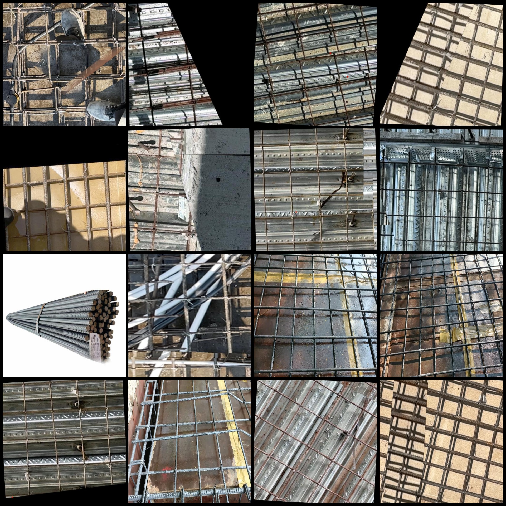
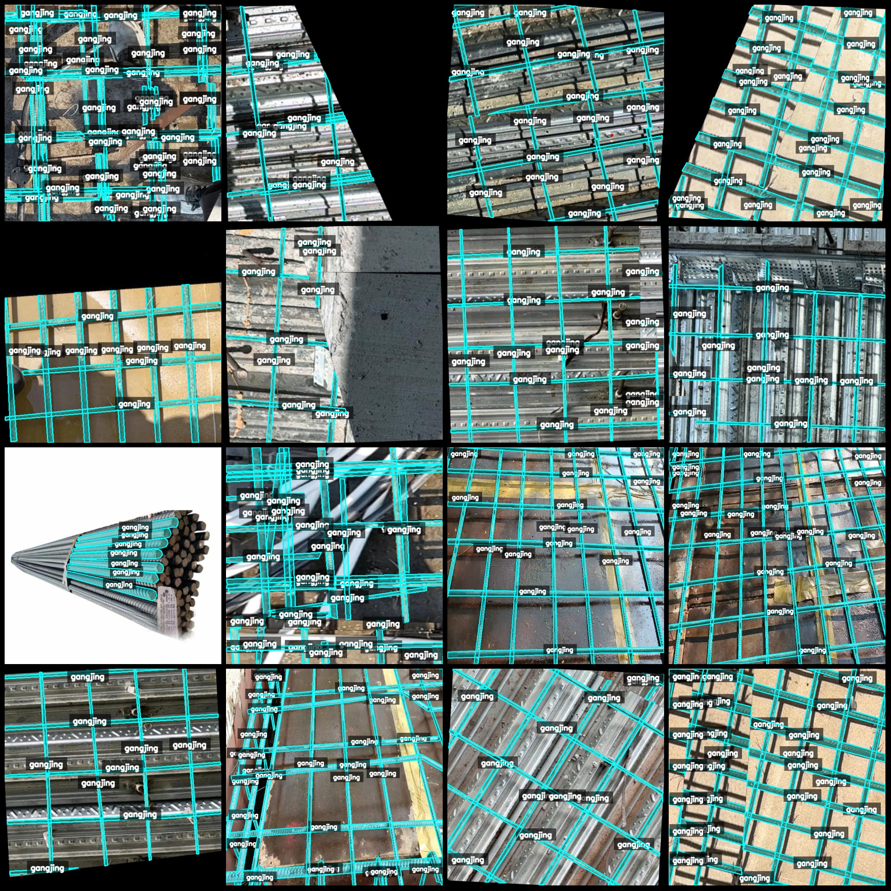
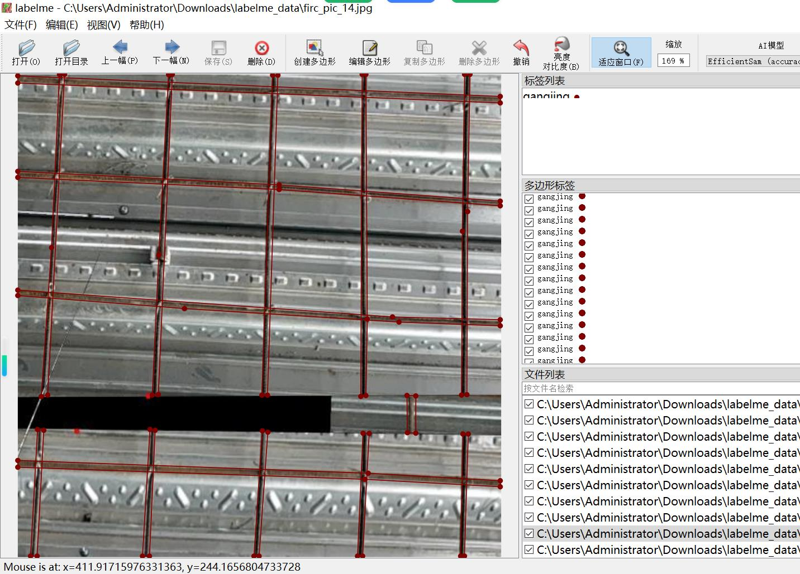

# Building Site Rebar Identification and Segmentation Dataset in labelme Format: 3535 Images, 1 Class

Dataset format: labelme format (without mask files, only including jpg images and corresponding json files)
Number of image files (number of jpg files): 3535
Number of annotations (json files): 3535
Number of annotation categories: 1
Annotation category name: ["gangjing"]
Number of bounding boxes per category:
gangjing count = 75936
Total number of bounding boxes: 75936
Labelme version used for annotation: labelme = 5.5.0
Image resolution: Multiple resolution images, such as 588x525, 559x531, etc.
Annotation rules: Polygons are drawn around the category
Important note: The dataset can be edited using labelme, but the json dataset needs to be converted into either a mask or yolo format or coco format for semantic segmentation or instance segmentation
Special declaration: This dataset does not guarantee the accuracy of the trained models or weight files
Image preview:
Annotation example:
Randomly selected 16 images for annotation:
Annotation drawing result:
Labelme editing image example:

Image

Here is a pay link on Stripe ( https://buy.stripe.com/3cs8yP7sY87d0vu9AB ). Please contact me lonlonago@foxmail.com after funding $89, and I will send you a complete data files , thank you!

